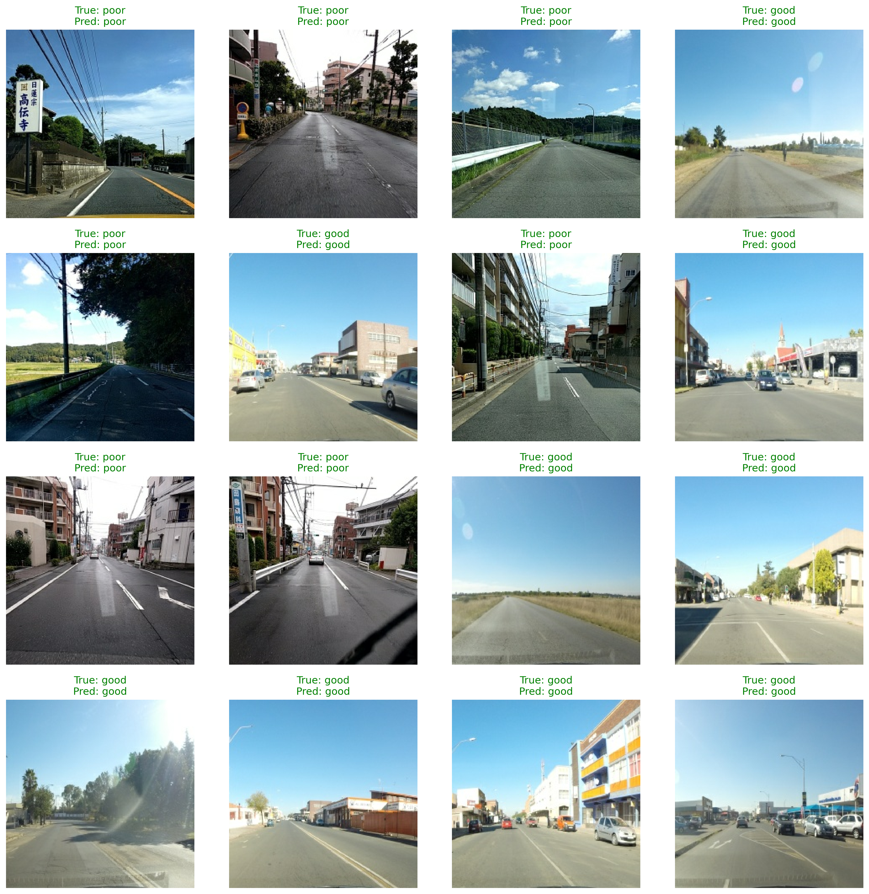

# Road Surface Condition CNN

A deep learning model to classify road surface conditions from images into four categories: `Good`, `Poor`, and `Very Poor`.

## Table of Contents

- [Getting Started](#getting-started)
- [Project Structure](#project-structure)
- [Training a New Model](#training-a-new-model)
- [Results](#results)
- [Report](#report)

## Getting Started

This guide will help you get the project up and running using the pre-trained model.

### Prerequisites

- Python 3.12+
- `pip`

### Installation

1.  Clone the repository:

    ```bash
    git clone https://github.com/your-username/Road-Surface-Condition-CNN.git
    cd Road-Surface-Condition-CNN
    ```

2.  Install the required dependencies:
    ```bash
    pip install -r requirements.txt
    ```

### Download the Pre-trained Model

The pre-trained model is available on Google Drive.

1.  **[Download the model](https://drive.google.com/file/d/1Zo_j-OSVwYh45CVOuFx_lmQ_De_mFaC_/view?usp=drive_link)** (98% accuracy).
2.  Create a `models/` directory in the project root.
3.  Place the downloaded file in the `models/` directory, ensuring the path is `models/best_road_model.keras`.

> **Note:** The model is not included in the git repository due to its large size (150MB).

### Run the GUI Application

You can use the GUI application to classify road images. Sample images are available in the `sample_test_data/` directory.

To run the application:

```bash
python code/inference.py
```

This will open a window where you can select an image and see the predicted classification.

## Project Structure

```
├── code/
│   ├── __init__.py
│   ├── evaluation.py
│   ├── inference.py
│   ├── loading_data.py
│   ├── model.py
│   ├── prepare_data.py
│   ├── training.py
│   └── visualizations.py
├── data_set/
│   ├── raw/
│   └── splitted/
├── models/
│   └── best_road_model.keras  (after downloading or training a new one)
├── results/
├── sample_test_data/
├── README.md
└── requirements.txt
```

## Training a New Model

If you want to train the model from scratch, follow these steps.

### 1. Dataset Setup

1.  Download the dataset from [Kaggle: Road Damage Classification and Assessment](https://www.kaggle.com/datasets/prudhvignv/road-damage-classification-and-assessment/data).
2.  Place the raw data in the `data_set/raw/` directory, organized by category (`good`, `poor`, `satisfactory`, `very_poor`).

### 2. Data Preprocessing

This step resizes, augments (brightness, contrast, rotation, flip), and organizes the images.

To run the preprocessing script:

```bash
python code/prepare_data.py
```

Raw images from `data_set/raw/` will be processed and saved in `data_set/splitted/`.

### 3. Model Training

This script loads the preprocessed data, builds the CNN model, and trains it.

To start the training:

```bash
python code/training.py
```

- The best model is saved as `models/best_road_model.keras`.
- Training logs are saved in `logs/training.txt`.
- Training history is saved in `results/training_history.csv`.

### 4. Model Evaluation

This script evaluates the model's performance on the test set.

To evaluate the model:

```bash
python code/evaluation.py
```

- The evaluation report is saved in `logs/evaluation.txt`.
- Visualizations (accuracy/loss curves, confusion matrix) are saved in the `results/` directory.

## Results

The `results/` directory contains visualizations generated during training and evaluation:

- `accuracy_curve.png`: Model accuracy over epochs.
  

- `loss_curve.png`: Model loss over epochs.
  

- `confusion_matrix_visual.png`: Confusion matrix of the model's predictions.
  

- `classification_report.png`: Classification report with precision, recall, and F1-score.
  

- `sample_predictions.png`: Example predictions on test images.
  

## Report

The report can be found in `report/report.pdf`.
